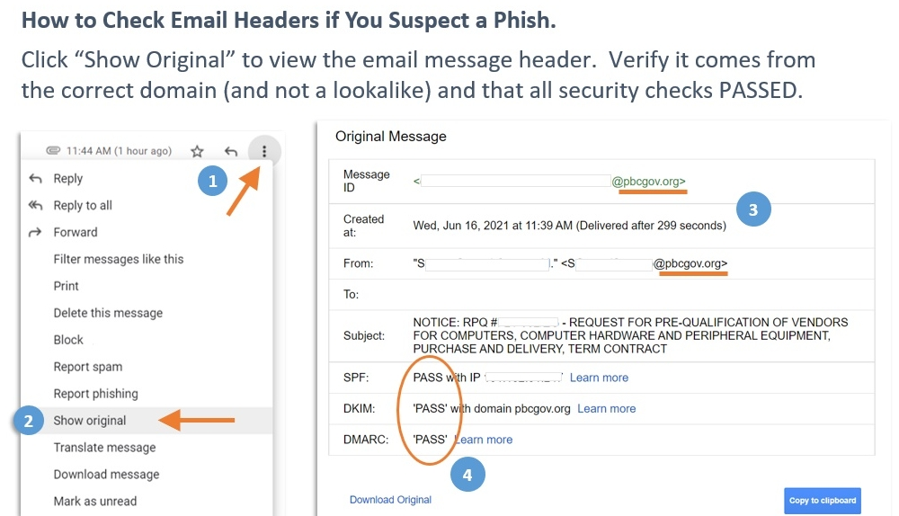
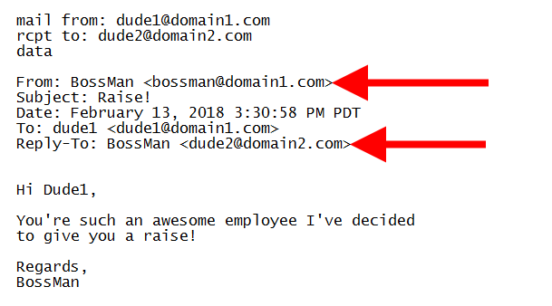
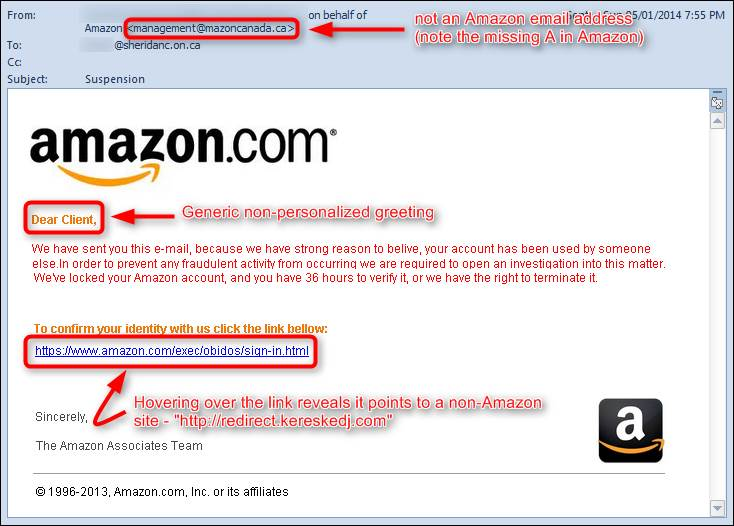
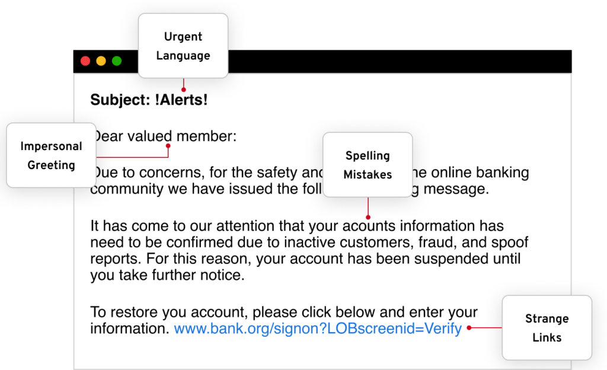
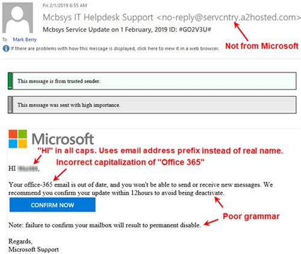

---

## 🔍 Step-by-Step Phishing Email Analysis

### 1. Check Email Headers for Discrepancies
- Tools: [MXToolbox](https://mxtoolbox.com/EmailHeaders.aspx), [Google Header Analyzer](https://toolbox.googleapps.com/apps/messageheader/)
- Look for:
  - `Return-Path` mismatch
  - Failed SPF/DKIM/DMARC
  - Suspicious IP in `Received` fields

📸 

---

### 2. Examine the Sender's Email Address
- Watch for spoofed or misspelled domains 

📸 

---

### 3. Identify Suspicious Links
- Hover over links without clicking
- Ensure URLs match their claimed domain 

📸 

---

### 4. Look for Urgent or Threatening Language
- Common phrases include:
  - "Your account has been suspended"
  - "You must act now"
  - "Final warning!"

📸 

---

### 5. Check for Spelling or Grammar Errors
- Phishing emails often contain awkward phrasing, misspellings, or odd formatting

📸 

---

## ✅ Summary of Phishing Traits Found

| Trait                        | Status | Notes                                 |
|-----------------------------|--------|---------------------------------------|
| Spoofed sender address      | ✅     | Mismatched domain in From field       |
| SPF/DKIM/DMARC failed       | ✅     | Header authentication failed          |
| Mismatched or fake URLs     | ✅     | Hover revealed phishing destination   |
| Urgent/threatening tone     | ✅     | Message pressures immediate action    |
| Spelling/grammar issues     | ✅     | Multiple typos and formatting errors  |

---

## 📚 Screenshot References

Screenshots used in this report are from trusted educational resources:

- [Norton – Phishing Email Examples](https://us.norton.com/blog/online-scams/phishing-email-examples)
- [CanIPhish – 40 Phishing Email Templates](https://caniphish.com/phishing-email-examples)
- [HubSpot – Phishing Scenarios](https://blog.hubspot.com/marketing/phishing-email-examples)
- [Firewall Times – Common Phishing Types](https://firewalltimes.com/phishing-email-examples/)
- [The SSL Store – Best & Worst Examples](https://www.thesslstore.com/blog/phishing-email-examples-the-best-worst/)

---

## 🧰 Tools Used

- [Google Messageheader Tool](https://toolbox.googleapps.com/apps/messageheader/)
- [MXToolbox Header Analyzer](https://mxtoolbox.com/EmailHeaders.aspx)
- [VirusTotal](https://www.virustotal.com/)
- [Have I Been Pwned](https://haveibeenpwned.com/)

---

## 📌 License

This repository is for **educational purposes only**. Do not use any materials herein for malicious activities. Respect all copyrights.
